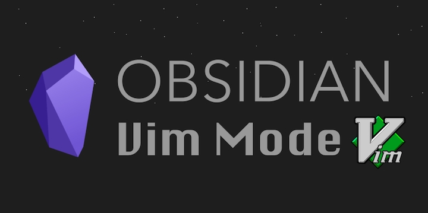

🎁 A curated list of awesome plugins and some for Obsidian Vim Mode. 🎉

# Plugins

| Name | Description | Credits |
| :--: | :---------- | :------: |
| [Obsidian Vimrc Support Plugin](https://github.com/esm7/obsidian-vimrc-support) | This plugin loads a file of Vim commands from VAULT_ROOT/.obsidian.vimrc. For users of the Obsidian.md Vim mode, this is very useful for making various settings (most notably keymaps) persist. | [esm7](https://github.com/esm7) |
| [Obsidian Vim IM Switch Plugin](https://github.com/yuanotes/obsidian-vim-im-switch-plugin) | This plug-in allows you to automatically switch between input methods when using Obsidian, after starting Vim key binding. | [yuanotes](https://github.com/yuanotes) |
| [Obsidian Vim IM Select Plugin](https://github.com/ALONELUR/vim-im-select-obsidian) | This plugin is used to automatically switch the current input method of the system when vim key binding is used in Obsidian, to prevent non-English input method from causing key binding failure in vim normal mode. | [Alonelur](https://github.com/ALONELUR) |
| [Word Splitting for Simplified Chinese in Edit Mode and Vim Mode](https://github.com/aidenlx/cm-chs-patch) | A patch for Obsidian's built-in CodeMirror Editor to support Simplified Chinese word splitting in Edit Mode and Vim Mode | [aidenlx](https://github.com/aidenlx) |
| [Obsidian Vim Reading View Navigation](https://github.com/kometenstaub/obsidian-vim-reading-view-navigation) | This plugin allows to scroll with `hjkl` in the Reading View. | [kometenstaub](https://github.com/kometenstaub) |
| [Obsidian Vim Yank Highlighter](https://github.com/kometenstaub/obsidian-vim-yank-highlight) | This plugin highlight the yank line in the Editing View | [kometenstaub](https://github.com/kometenstaub) |
| [Obsidian VimEx](https://github.com/jiyee/obsidian-vimex) | This plugin enhance the experience of Vim Mode in Obsidian | [jiyee](https://github.com/jiyee) |

# Article

- [VIM Mode - Quality of Life Improvements](https://forum.obsidian.md/t/vim-mode-quality-of-life-improvements/429)
- [Obsidian 搭配 Vim Mode，提升中文写作体验](https://sspai.com/post/78030)
- [Obsidian and Vim Mode](https://jamierubin.net/2021/03/23/obsidian-and-vim-mode/)

